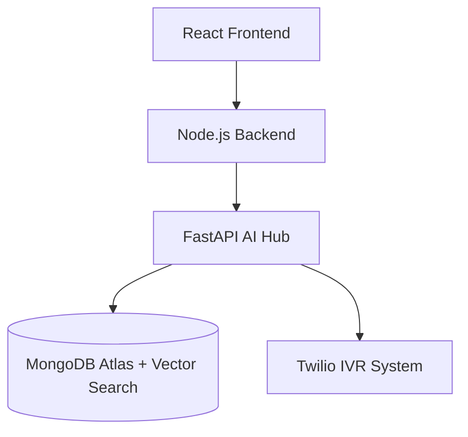
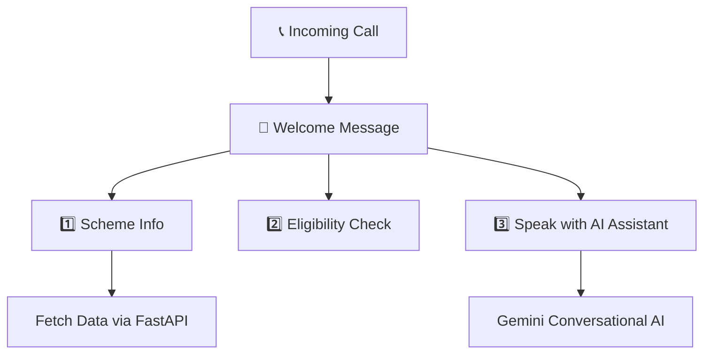

# 🪷 **JanSetu**

### _AI-Powered Government Scheme Discovery Platform_

> Bridging Citizens and Government Services through Intelligent Technology 🇮🇳

---


<p align="center">
  
  
  
  
</p>

---

## 🎯 **Moto**

> “If AI can revolutionize e-commerce recommendations, why not help citizens discover the government schemes they deserve?”

---

## 🧩 **Key Features Overview**

| Feature                | Description                               | Example                                    |
| ---------------------- | ----------------------------------------- | ------------------------------------------ |
| 🔍 **Smart Discovery** | AI-driven search with eligibility scoring | “Farmer subsidy in Odisha” → PM-KISAN      |
| 🤖 **AI Assistant**    | Conversational Gemini-based bot           | “Health insurance in WB” → Ayushman Bharat |
| 📞 **IVR Support**     | Voice + keypad system for non-smartphones | “Press 1 for scheme info”                  |
| 📄 **OCR & Form Help** | AI field extraction + TTS guidance        | Upload Aadhaar → get step-by-step assist   |
| 👥 **Community Forum** | Role-based posts + AI moderation          | NGO feedback, verified badges              |

---

## ⚙️ **Architecture at a Glance**



---

## 🚀 **Tech Stack Snapshot**

| Layer              | Technology                     | Icon |
| :----------------- | :----------------------------- | :--: |
| 🎨 **Frontend**    | React 19 + Tailwind + Vite     |  ⚛️  |
| 🔧 **Backend**     | Node.js + Express              |  🟩  |
| 🧠 **AI Services** | FastAPI + Transformers         |  🤖  |
| 🗄️ **Database**    | MongoDB Atlas (Vector Search)  |  🍃  |
| 📞 **Voice**       | Twilio + Ngrok                 |  ☎️  |
| 🌐 **Translation** | IndicTrans2 + Google Translate |  🌍  |
| 🔐 **Auth**        | JWT + bcrypt                   |  🔒  |

---

## 🧠 **AI/ML Highlights**

| Component        | Model                             | Purpose                     |
| :--------------- | :-------------------------------- | :-------------------------- |
| 🧭 Vector Search | `Xenova/all-MiniLM-L6-v2`         | Semantic scheme matching    |
| 🌐 Translation   | `IndicTrans2`                     | 22+ Indian languages        |
| 💬 Sentiment     | `cardiffnlp/twitter-roberta-base` | Community feedback analysis |
| 👁️ OCR           | `Tesseract` + `DiT`               | Document understanding      |
| ⚖️ Moderation    | Custom TF-IDF + SVM               | Hate speech detection       |

---

## 💡 **Sample Use Cases**

| User Query                        | Output Example                    |
| --------------------------------- | --------------------------------- |
| “Farmer loan scheme West Bengal”  | 🪙 PM-KISAN – ₹6,000/year         |
| “मुझे स्वास्थ्य बीमा चाहिए”       | 🏥 Ayushman Bharat – ₹5L coverage |
| “Scholarships for girls in Bihar” | 🎓 NSP, PM YASASVI                |

---

## 📞 **IVR Menu Flow**



---

## 📊 **Monitoring Dashboard**

| Tool              | Purpose              | Metric Examples               |
| ----------------- | -------------------- | ----------------------------- |
| 🟣 **Prometheus** | Metrics collection   | API latency, DB query time    |
| 🟢 **Grafana**    | Real-time dashboards | IVR funnel analytics          |
| 🟠 **Loki**       | Centralized logging  | OCR or Twilio errors          |
| 🔵 **Tempo**      | Distributed tracing  | Cross-service flow tracking   |
| ⚡ **Sentry**     | Error monitoring     | React crashes, backend issues |

---

## 🧱 **Quick Setup**

<details>
<summary>🧩 Click to Expand Installation Steps</summary>

### 1️⃣ **Backend**

```bash
cd backend
npm install
npm run dev
```

### 2️⃣ **Frontend**

```bash
cd frontend
npm install
npm run dev
```

### 3️⃣ **AI Services**

```bash
cd fastAPI
pip install -r requirements.txt
uvicorn app.main:app --reload
```

### 4️⃣ **IVR**

```bash
ngrok http 8000
# Update Twilio webhook to Ngrok URL
```

</details>

---

## 🔐 **Security Highlights**

| Area                  | Strategy                      |
| --------------------- | ----------------------------- |
| 🛡️ Authentication     | JWT + bcrypt                  |
| 👁️ Role-based Access  | Citizen / NGO / Govt / Admin  |
| 📜 Data Privacy       | GDPR & DPDP compliant         |
| 🚫 Content Moderation | AI-powered hate speech filter |

---

## 📈 **Impact Metrics**

| Metric                 | Before           | With JanSetu         |    💥 Gain    |
| :--------------------- | :--------------- | :------------------- | :-----------: |
| Scheme discovery speed | Manual           | Instant              |     ⚡10x     |
| Form errors            | High             | Guided OCR           |    🧾 -80%    |
| Accessibility          | Language barrier | Multilingual + Voice |    🌍 100%    |
| Reach                  | Smartphone only  | IVR inclusive        | ☎️ Nationwide |

---

## 🧭 **Roadmap**

| Phase      | Feature                    | Status |
| ---------- | -------------------------- | :----: |
| 🔮 Phase 2 | Govt API integrations      |   🟡   |
| 📱 Phase 3 | Native mobile apps         |   🔵   |
| 🗣️ Phase 4 | Advanced voice chatbot     |   🟣   |
| 📊 Phase 5 | Policy analytics dashboard |   🟢   |

---

## 🌍 **Vision**

> To make every Indian citizen aware of — and able to benefit from — the government services meant for them.
> _Empowering India, One Scheme at a Time._ 🇮🇳

---

## 🧾 **License**

**MIT © 2025 JanSetu Team**
Built for the **Digital India Initiative**

---

## 🙏 **Acknowledgments**

<table>
<tr>
<td>🤖 Hugging Face</td><td>🧠 Google Gemini</td><td>📞 Twilio</td><td>🍃 MongoDB Atlas</td>
</tr>
</table>

---

**🚀 JanSetu — Making Government Services Accessible to Every Indian Citizen**
